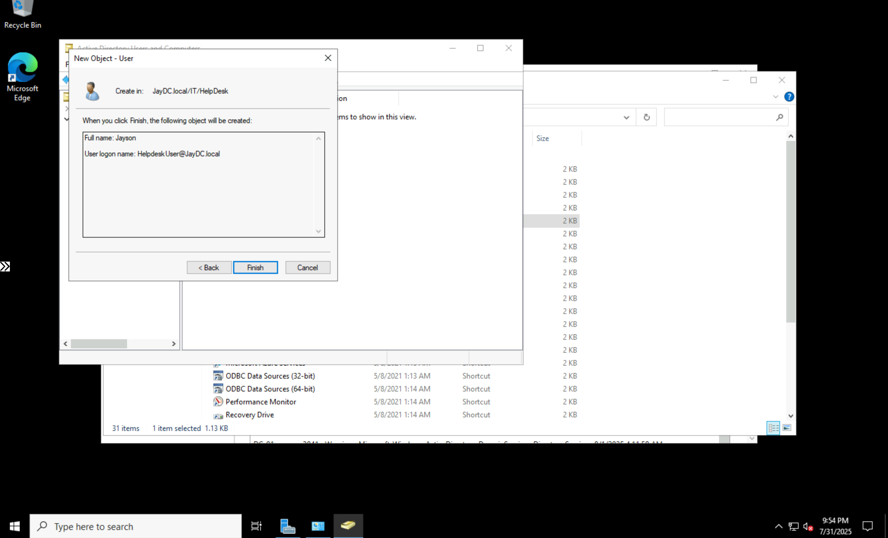
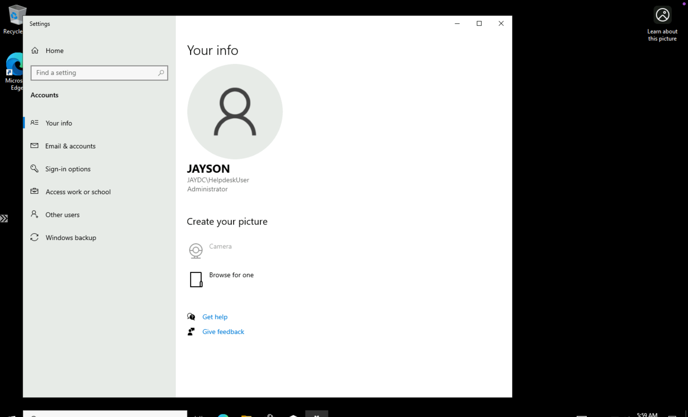

# Windows Server Active Directory Lab

## Overview
This project demonstrates the deployment and configuration of a **Windows Server 2022 Active Directory Domain Services (AD DS) lab** in Microsoft Azure. The goal was to build a functional, small-scale network environment from the ground up, simulating a common IT administrative task.

## Skills Demonstrated
- **Windows Server Administration:** Hands-on experience with core server roles and management tools.
- **Azure Cloud Infrastructure:** Deployment and management of virtual machines and network resources (VM, VNet, Subnets).
- **Active Directory:** Full lifecycle of AD DS, from installation and domain promotion to user and group management.
- **DNS and Networking:** Configuration and troubleshooting of DNS, IP addresses, and client connectivity.
- **Troubleshooting:** Utilizing command-line tools like `dcdiag` and `ipconfig` to verify system health and network status.
- **Documentation:** Creating a clear and professional record of a technical project workflow.

---

## Lab Walkthrough

### **Phase 1: Building the Foundation (Server & Domain Controller)**

This phase focused on establishing the core infrastructure for the lab, deploying and configuring the main domain controller.

* **Azure VM Deployment:** I began by deploying a Windows Server 2022 VM (`DC-01`) in Azure, setting up its networking within a dedicated resource group and subnet.

* **Active Directory Installation:** After connecting to the VM, I installed the **Active Directory Domain Services** role using the Server Manager. This involved configuring deployment settings, including creating a new forest for the domain `JayDC.local`.

* **Domain Promotion & Verification:** The server was then promoted to a domain controller. I performed key diagnostic checks with `dcdiag` to confirm the health and functionality of the new domain, and verified the DNS configuration using `ipconfig /all`.

### **Phase 2: User Management and Client Integration**

With the core infrastructure in place, this phase demonstrated how to manage users and integrate a client machine into the new domain.

* **User and Group Creation:** Using the **Active Directory Users and Computers (ADUC)** console, I created two user accounts with different permissions and placed them in relevant OUs to simulate a real-world environment.

* **Client Deployment and Domain Join:** I deployed a new Windows 10 Pro VM (`client-01`) and successfully joined it to the **`JayDC.local`** domain, proving the client-server trust relationship was established.

* **Permissions Verification:** The final step was to confirm that a domain user could not only log in to the client machine but also had the correct, pre-defined administrative permissions, a critical security check.

---

## 📖 Key Takeaways
This project was an end-to-end demonstration of setting up a foundational network environment. It highlights practical skills in cloud deployment, server administration, and active directory management—all essential for an IT professional.
